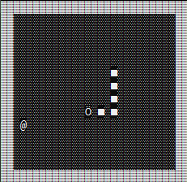

# Snake

Console based snake game for windows. I have no intention of porting this to Linux.  
Only works on windows because of dependence on `kbhit()` and `getch()`.  

Compilation can be done using `make` and `gcc` on windows or you can compile the `main.c` file yourself.  

Note: All the following keys **must** be used with Caps Lock **OFF**!  
`wasd` to move the snake. Press any of the these keys to start the game.  
`q` to quit. Can also do it with `Ctrl+c`

###### developed by @krishna2803
